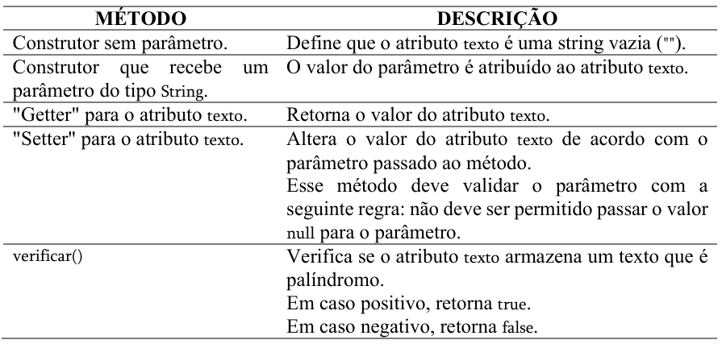

# ED1-LAB1B-Aula1
## Java e POO – Classe Palindromo (atividade em dupla ou trio) 
### Objetivos 
- Treinar conceitos de Programação Orientada a Objetos (POO) com a linguagem Java. 
- Verificar dificuldades com a linguagem Java e conceitos de POO. 
- Criar soluções próprias e pesquisar referências para conseguir resolver tarefas 
pertinentes à atividade – por exemplo: como é feita a verificação de palíndromos, 
como aceitar palavras com maiúsculas e minúsculas, como aceitar palavras com 
espaços em branco. 
- O(a) professor(a) não deve simplesmente fornecer a resposta/solução final, mas 
guiar e ajudar no raciocínio por meio de perguntas e afirmações (“O que você 
pretendia fazer com esse código?”, “Está (ou não) no caminho certo”, etc.). 
- Resolver o problema sem o uso do TAD Pilha (assunto da próxima aula, sendo que 
essa solução será comparada com uma versão que usa o TAD Pilha). 
Instruções 
- A atividade a seguir deve ser resolvida usando a linguagem Java. 
- Coloque a identificação da dupla ou trio – nomes completos e RAs – no início de 
cada arquivo, como comentário (use // no começo de cada linha que queira comentar). 
- Inclua como comentário todas as referências (livros, artigos, sites, vídeos, entre 
outros) usadas para responder as questões. Caso use ChatGPT ou similar, inclua, em 
um documento PDF, o histórico da interação (prompt + respostas). 
- Compacte os arquivos *.java em um único arquivo, no formato ZIP. 
### Atividade 
Declare uma classe Java chamada Palindromo (arquivo Palindromo.java) que possui um 
atributo privado chamado texto, do tipo String, e os seguintes métodos públicos:

Atenção quanto às restrições de implementação da classe Palindromo: 
- A verificação de palíndromo não deve usar pilha(s). 
- Não devem existir chamadas à System.out.print*() nos métodos da classe Palindromo.
Além da classe Palindromo, seu programa deve ter uma classe Main (arquivo Main.java) que 
contém o ponto de partida do programa Java, isto é, o método public static void main(String[] 
args) { ... }. 
Na main(), o programa deve pedir para a pessoa informar um texto qualquer e, em seguida, 
indicar se o texto informado é ou não é um palíndromo, usando a classe Palindromo que 
você implementou. 
Por exemplo, "Mussum" e "A sacada da casa" são palíndromos, mas "Bolton" e "Hello World" não 
são.
O programa deve considerar a string vazia ("") como palíndromo. 
O programa pode assumir que a pessoa não vai inserir palavras com acentos, sinais de 
pontuação e outros símbolos/caracteres especiais. Ou seja, embora a frase "Olá, galo!" seja 
considerada um palíndromo, para essa atividade não há problema se o programa indicar 
que o texto informado não é um palíndromo. No entanto, se a pessoa informar "Ola galo", 
o programa deve indicar que o texto é um palíndromo. 
### Desafios (opcionais) 
1. Altere o código para que o programa consiga avaliar palíndromos que possuem 
palavras com acentos, sinais de pontuação e outros símbolos/caracteres especiais. 
Assim, nessa nova versão, a frase "Olá, galo!" deve ser considerada um palíndromo. 
2. Altere o código para que o programa continue pedindo para a pessoa informar um 
texto qualquer (e continue mostrando se o texto informado é ou não é um 
palíndromo), até que a pessoa informe o texto "/sair" (sem aspas), condição que faz 
com que o programa seja encerrado.